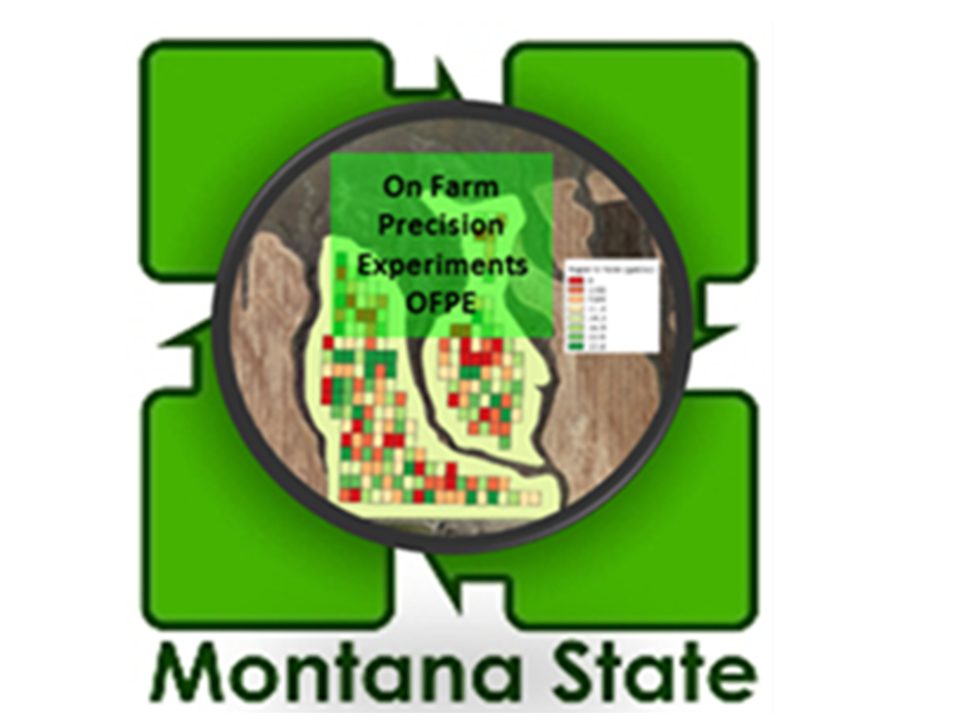
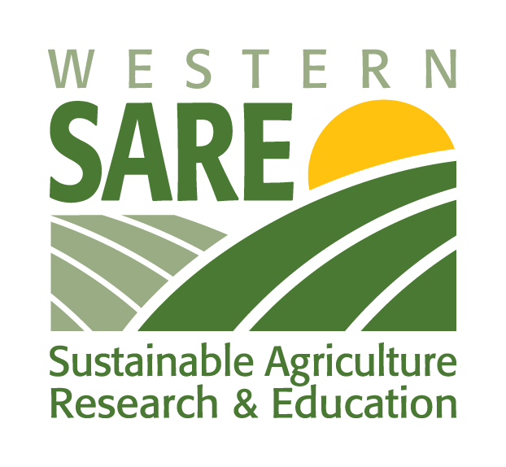

<!-- README.md is generated from README.Rmd. Please edit that file -->

# OFPEDATA  


[](https://travis-ci.com/paulhegedus/OFPEDATA)

Example data from Montana State University’s On-Farm Precision
Experiments project. Used to demonstrate the utility of the OFPE Tools
R-Package.

## Installation

You can install the released version of OFPE from
[GitHub](https://github.com) with:

``` r
# install.packages("devtools")
devtools::install_github("paulhegedus/OFPEDATA")
```

## Information

This package contains example data related to the On-Farm Precision
Experiments (OFPE) project at Montana State University. This data is
used to demonstrate the usage of the OFPE Tools R-package in the
associated vignettes of that package. It contains field and farm
boundaries as well as raw data collected on farms. This data is
primarily used to show users how to set up their OFPE formatted
PostgreSQL database in the first step of the OFPE data workflow. See the
OFPE Tools package for more information and links to further resources.
OFPE Tools Github: <https://github.com/paulhegedus/OFPE.git>

More resources/products of the MSU OFPE Project can be found at;

  - [OFPE Tools Package](https://github.com/paulhegedus/OFPE.git)
  - [OFPE Project Website](https://sites.google.com/site/ofpeframework/)
  - [OFPE Technical
    Website](https://paulhegedus.github.io/OFPE-Website/)
  - [OFPE Web
    Application](https://paulhegedus.shinyapps.io/OFPE_AnalysisAndSim_App_v1/?_ga=2.189182059.1336631904.1592115204-590292424.1592115204)
  - The OFPE Tools package vignettes
  - [OFPE CropScan 3300H Visualization
    Application](https://paulhegedus.shinyapps.io/OFPE_Protein_Application/?_ga=2.69643152.1880072526.1592481594-590292424.1592115204)

## Contents

The data included in this package are from real farms. Wheat yield and
protein data are included, gathered from yield monitors on crop
combines, and an aftermarket CropScan 3300H grain protein content
monitor installed in the cab. Yield data are collected at a much denser
rate than protein (\~3 seconds vs. \~10 seconds). As-applied input data
such as nitrogen fertilizer and seed rates are also included. These data
are collected directly from sprayer/spreader and seeder equipment.

For each field represented in this package there are at least two data
files for each year data was collected on that field. These include
yield and an as-applied input shapefiles, and in some cases grain
protein content ‘csv’ CropScan files. Finally, there is a field boundary
shapefile and a farm boundary within which the field falls. These are
used to create the OFPE formatted database. Again see the [OFPE
Technical Website](https://paulhegedus.github.io/OFPE-Website/) and the
[OFPE Project Website](https://sites.google.com/site/ofpeframework/) for
more detailed information on the OFPE data workflow and project.

There are three fields from three different farmers included in the
package. Two are conventionally managed fields where the varied input is
nitrogen fertilizer, and one is an organic field where the seeding rate
is varied. Both conventionally managed fields are in Montana and have
had two years of experimentation (2016 and 2018) and include as-applied
nitrogen fertilizer, winter wheat yield, and grain protein content. The
organically managed field is in Manitoba, and contains spring wheat
yield and seeding rates from 2019 and the previous crop, oats, yield
from 2017.

## Funding

The OFPE project was initially funded by the Montana Research and
Economic Development Initiative
([MREDI](https://mus.edu/research/research_initiative.html)) and is
continued to be funded by the Montana Fertilizer Advisory Committee
([MFAC](https://agriculture.montana.edu/mfac/index.html)). Other funding
sources include the Montana State University College of Agriculture
([MSU CoA](https://agriculture.montana.edu)), the MSU Department Land
Resources and Environmental Sciences
([LRES](https://landresources.montana.edu)), and the Montana Institute
on Ecosystems ([MT IoE](https://montanaioe.org)). Other support and
funding has been provided by the Data Intensive Farm Management project
at the University of Illinois
([DIFM](https://publish.illinois.edu/data-intensive-farm-managment/)).
Funding for Paul Hegedus is provided by MSU and the Graduate Student
Grants from the Western Sustainable Agriculture Research and Education
(WSARE).

#     
